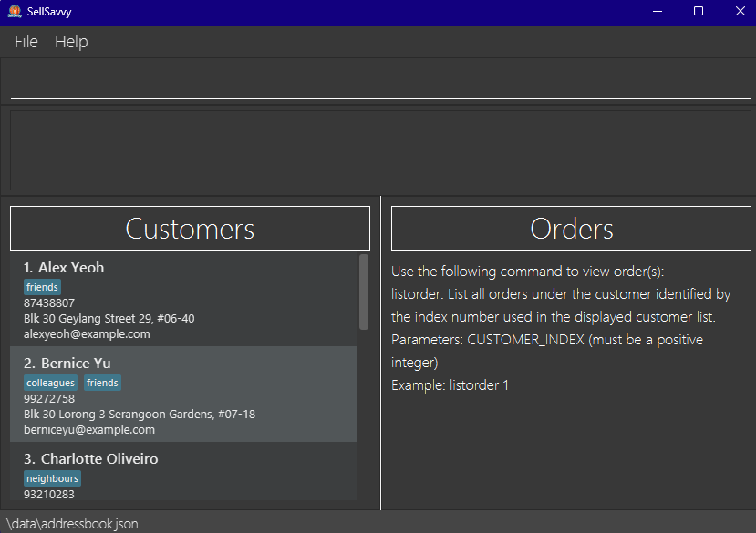
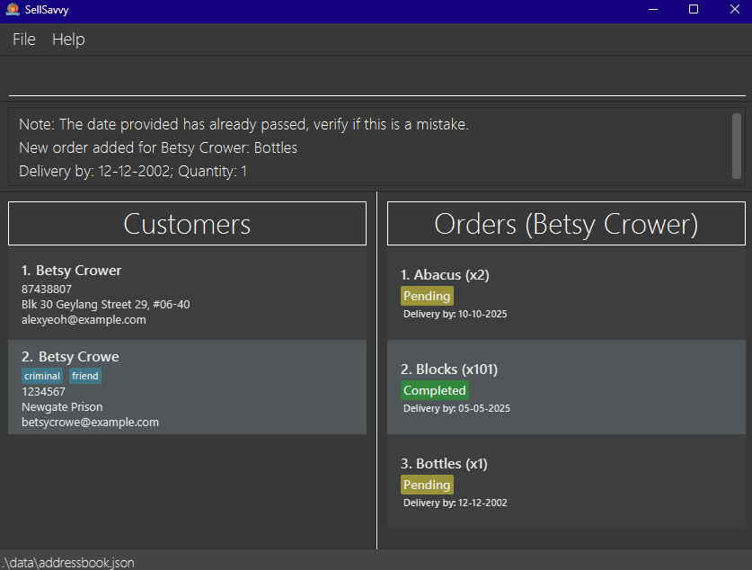
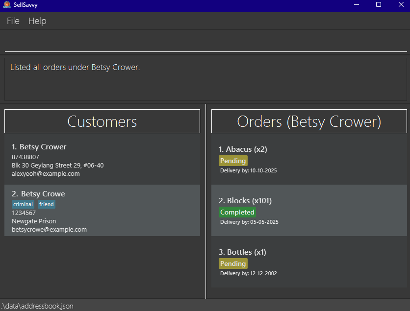
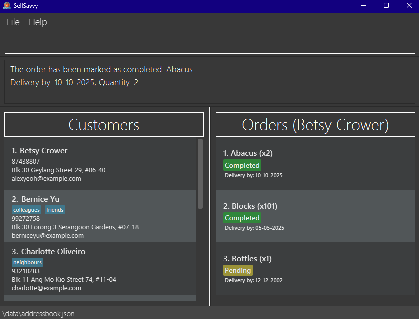

# SellSavvy User Guide

SellSavvy is a lightweight and convenient desktop application for **managing your customers' contacts and their orders**, aiming to streamline your online drop-shipping management. It offers a centralised platform to **organise customer contacts, track order deliveries and store the data**. 

SellSavvy is **optimized for users who prefer Command Line Interface** (CLI) while still having the benefits of a Graphical User Interface (GUI). If you can type fast, SellSavvy can get your drop-shipping management tasks done faster than traditional GUI apps.

--------------------------------------------------------------------------------------------------------------------

## Quick start

1. Ensure you have Java `17` or above installed in your Computer.

2. Download the latest `.jar` file from [here](https://github.com/AY2425S1-CS2103T-F14a-2/tp/releases).

3. Copy the file to the folder you want to use as the _home folder_ for SellSavvy.

4. Open a command terminal, `cd` into the folder you put the jar file in.

5. Use `java -jar sellsavvy.jar` command to run the application. 
   A GUI similar to the below should appear in a few seconds. Note how the app contains some sample data. 
   

6. Type the command in the command box and press Enter to execute it. e.g. typing **`help`** and pressing Enter will open the help window. 
   Some example commands you can try:

   * `listcustomer` : Lists all customers' contacts as a displayed customer list.

   * `addcustomer n/John Doe p/98765432 e/johnd@example.com a/John street, block 123, #01-01` : Adds a customer named `John Doe` to the displayed customer list.

   * `deletecustomer 3` : Deletes the 3rd customer contact shown in the displayed customer list.

   * `listorder 1` : Lists all orders under the 1st customer as a displayed order list.
   
   * `addorder 1 i/Lamp d/20-12-2024 q/2` : Adds an order for a `Lamp` item to the displayed order list.

   * `markorder 1` : Marks the 1st order shown in the displayed order list as completed.

   * `clear` : Deletes all customers' contacts.

   * `exit` : Exits the app.

7. Refer to the [Features](#features) below for details of each command.

--------------------------------------------------------------------------------------------------------------------

## Features

<box type="info" seamless>

**Notes about the command format:** 

* Words in `UPPER_CASE` are the parameters to be supplied by the user. 
  e.g. in `add n/NAME`, `NAME` is a parameter which can be used as `add n/John Doe`.

* Items in square brackets are optional. 
  e.g `n/NAME [t/TAG]` can be used as `n/John Doe t/friend` or as `n/John Doe`.

* Items with `…`​ after them can be used multiple times including zero times. 
  e.g. `[t/TAG]…​` can be used as ` ` (i.e. 0 times), `t/friend`, `t/friend t/family` etc.

* Parameters can be in any order. 
  e.g. if the command specifies `n/NAME p/PHONE_NUMBER`, `p/PHONE_NUMBER n/NAME` is also acceptable.

* Parameters cannot be blank.

* Extraneous parameters for commands that do not take in parameters (such as `help`, `listcustomer`, `exit` and `clear`) will be ignored. 
  e.g. if the command specifies `help 123`, it will be interpreted as `help`.

* If you are using a PDF version of this document, be careful when copying and pasting commands that span multiple lines as space characters surrounding line-breaks may be omitted when copied over to the application.

* Command aliases are short forms of commands you can use to execute the commands more quickly and conveniently. 
  e.g. `listc` can be used instead of `listcustomer` to list all customers.
  </box>

### Viewing help : `help`

Shows a message explaining how to access the help page.

Format: `help`

### Adding a customer: `addcustomer`

Adds a customer to the address book.

Command aliases: `addc` 
Format: `addcustomer n/NAME p/PHONE_NUMBER e/EMAIL a/ADDRESS [t/TAG]…​`  
Examples:
* `addcustomer n/John Doe p/98765432 e/johnd@example.com a/John street, block 123, #01-01`
* `addc n/Betsy Crowe t/friend e/betsycrowe@example.com a/Newgate Prison p/1234567 t/criminal`

<box type="important">

##### Constraints

* `NAME` can only contain alphanumeric characters, spaces, and one of the following symbols: hyphen, comma, and apostrophe, where commas should be followed with a space.
* `NAME` should have alphanumeric characters before and after the symbol, and it should not be blank. Relationship indicator using "S/O" or "D/O" can be included but should be wrapped with spaces, and followed with the name of customer with stated relationship.
* Duplicated `NAME` is not allowed.
* If there is already a customer with similar `NAME` (same name excluding space and casing), a warning will be given.
* `PHONE_NUMBER` should only contains numbers, and it should at least be 3 digits long.
* `EMAIL` should be of the format `local-part` `@` `domain` and adhere to the following constraints:
  * The `local-part` should only contain alphanumeric characters and these special characters, excluding the parentheses, (+_.-). 
  * The `local-part` may not start or end with any special characters.
  * This is followed by a '@' and then a `domain` name.
  * The `domain` name is made up of domain labels separated by periods.
  * The `domain` name must:
      - end with a domain label at least 2 characters long
      - have each domain label start and end with alphanumeric characters
      - have each domain label consist of alphanumeric characters, separated only by hyphens, if any
* `ADDRESS` can take any values, and it should not be blank.
* `TAG` should be alphanumeric.
* Duplicated `TAG` will be ignored.
* If similar `TAG` (same name excluding space and casing) are added, a warning will be given.

</box>

<box type="tip">

#### Tips

* A customer can have any number of tags (including 0).

</box>

### Listing all customers : `listcustomer`

Shows a list of all customers in the address book.

Command aliases: `listc` 
Format: `listcustomer`

### Editing a customer : `editcustomer`

Edits an existing customer in the address book.

Command aliases: `editc` 
Format: `editcustomer CUSTOMER_INDEX [n/NAME] [p/PHONE] [e/EMAIL] [a/ADDRESS] [t/TAG]…​` 
Examples:
*  `editcustomer 1 p/91234567 e/johndoe@example.com` Edits the phone number and email address of the 1st customer to be `91234567` and `johndoe@example.com` respectively.
*  `editc 2 n/Betsy Crower t/` Edits the name of the 2nd customer to be `Betsy Crower` and clears all existing tags.

<box type="important">

##### Constraints

* Edits the customer at the specified `CUSTOMER_INDEX`. The index refers to the index number shown in the displayed customer list. The index **must be a positive integer** 1, 2, 3, …​
* At least one of the optional fields must be provided.
* You may refer to [Constraints of Addcustomer command](#constraints) for acceptable values of each field.
* Existing values will be updated to the input values.
* When editing tags, the existing tags of the customer will be removed i.e adding of tags is not cumulative.
* You can remove all the customer’s tags by typing `t/` without
    specifying any tags after it.

</box>

### Locating customers by name: `findcustomer`

Finds customers whose names contain any of the given keywords.

Command aliases: `findc` 
Format: `findcustomer KEYWORD [MORE_KEYWORDS]` 
Examples:
* `findcustomer John` returns `john` and `John Doe`
* `findc alex david` returns `Alex Yeoh`, `David Li` 
  

<box type="important">

##### Constraints

* The search is case-insensitive. e.g `hans` will match `Hans`
* The order of the keywords does not matter. e.g. `Hans Bo` will match `Bo Hans`
* Only the name is searched.
* Only full words will be matched e.g. `Han` will not match `Hans`
* Customers matching at least one keyword will be returned (i.e. `OR` search).
  e.g. `Hans Bo` will return `Hans Gruber`, `Bo Yang`

</box>

### Deleting a customer : `deletecustomer`

Deletes the specified customer from the address book.

Command aliases: `deletec` 
Format: `deletecustomer CUSTOMER_INDEX`
Examples:
* `listcustomer` followed by `deletecustomer 2` deletes the 2nd customer in the address book.
* `findcustomer Betsy` followed by `deletec 1` deletes the 1st customer in the results of the `find` command.

<box type="important">

##### Constraints
* Deletes the customer at the specified `CUSTOMER_INDEX`.
* The index refers to the index number shown in the displayed customer list.
* The index **must be a positive integer** 1, 2, 3, …​

</box>

### Adding an order under a customer : `addorder`

Adds an order under a specified customer from the address book.

Command aliases: `addo` 
Format: `addorder CUSTOMER_INDEX i/ITEM d/DATE [q/QUANTITY]` 
Examples:
* `addorder 2 i/Lamp d/20-11-2024 q/3` adds the order with item `Lamp`, quantity of **3** and delivery date `20-11-2024`, to the 2nd customer in the address book.
* `addo 1 i/Books d/02-03-2026` adds the order with item `Books`, quantity of **1** and delivery date `02-03-2026`, to the first customer in the address book.
* `findcustomer Betsy` followed by `addorder 1 i/Bottles d/12-12-2002 q/1` adds an order under the 1st customer in the results of the `findcustomer` command.
  

<box type="important">

##### Constraints

* Add an order under the customer at the specified `CUSTOMER_INDEX`, with a default `pending` status.
* The index refers to the index number shown in the displayed customer list.
* The index and quantity **must be a positive integer** 1, 2, 3, …​
* 'ITEM' can contain any printable characters, but it should not be blank.
* Date must follow the following format: `DD-MM-YYYY`
* If the quantity is not provided, the quantity will be set to a default value of **1**.
* If there already exists a pending order with similar item(same item excluding space and casing), identical quantity and date under that customer, a warning will be given.
* If the order `DATE` has elapsed the current date, a warning will be given.

</box>

### Listing all orders under a customer : `listorder`

List all orders of a specified customer from the address book.

Command aliases: `listo` 
Format: `listorder INDEX` 
Examples:
* `listcustomer` followed by `listorder 2` lists all orders of the 2nd customer in the address book.
* `findcustomer Betsy` followed by `listo 1` lists all orders of the 1st customer from the list of customers found with "Betsy".
  
<box type="important">

##### Constraints

* List all orders of the customer at the specified `INDEX`.
* The index refers to the index number shown in the displayed customer list.
* The index **must be a positive integer** 1, 2, 3, …​

</box>

### Deleting an order under a customer : `deleteorder`

Deletes an order from the selected customer's displayed order list.

Command aliases: `deleteo` 
Format: `deleteorder ORDER_INDEX` 
Examples:
* `deleteorder 1` deletes the order with index 1 from the selected customer.
* `listorder 1` followed by `deleteo 2` selects the 1st customer in the address book and deletes the 2nd order under the 1st customer.

<box type="important">

##### Constraints

* A customer's order list must first be displayed before deleting an order from that customer.
* Deletes an order under the selected customer at the specified `ORDER_INDEX`.
* The order index refers to the index number shown in the displayed **order** list of the selected customer.
* The index **must be a positive integer** 1, 2, 3, …​

</box>

### Editing an order : `editorder`

Edits an order from the selected customer's displayed order list.

Command aliases: `edito` 
Format: `editorder ORDER_INDEX [i/ITEM] [d/DATE] [q/QUANTITY]` 
Examples:
*  `editorder 1 i/Light bulb d/21-11-2025` edits the item and delivery date of the 1st order to be `Light bulb` and `21-11-2025` respectively.
*  `edito 2 q/22` edits the quantity of the 2nd order to be `22`.
*  `listorder 1` followed by `editorder 3 i/Wallet` selects the 1st customer in the address book and edits the item of the 3rd order under the 1st customer to be `Wallet`.

<box type="important">

##### Constraints

* A customer's order list must first be displayed before editing an order from that customer.
* Edits the order at the specified `ORDER_INDEX`. The order index refers to the index number shown in the displayed order list.
* The order index **must be a positive integer** 1, 2, 3, …​
* At least one of the optional fields must be provided, and order status cannot be edited by this command.
* You may refer to [Constraints of Addorder command](#order-constraints) for acceptable values of each field.
* Existing values will be updated to the input values.

</box>

### Mark an order as completed : `markorder`

Marks an order from the selected customer's displayed order list as completed.

Command aliases: `marko` 
Format: `markorder ORDER_INDEX` 
Examples:
* `markorder 1` marks the order with index 1 from the displayed order list as completed.
* `listorder 1` followed by `marko 2` selects the 1st customer in the address book and marks the 2nd order under the 1st customer as completed.
  

<box type="important">

##### Constraints

* A customer's order list must first be displayed before marking an order from that customer.
* Marks a pending order under the selected customer at the specified `ORDER_INDEX` as completed.
* The order index refers to the index number shown in the **displayed order list**.
* The index **must be a positive integer** 1, 2, 3, …​

</box>

### Reverts an order to pending status : `unmarkorder`

Reverts an order from the selected customer's displayed order list to pending.

Command aliases: `unmarko` 
Format: `unmarkorder ORDER_INDEX` 
Examples:
* `unmarkorder 1` reverts the order with index 1 from the displayed order list to pending.
* `listorder 1` followed by `unmarko 2` selects the 1st customer in the address book and reverts the 2nd order under the 1st customer to pending.

<box type="important">

##### Constraints

* A customer's order list must first be displayed before unmarking an order from that customer.
* Reverts a completed order under the selected customer at the specified `ORDER_INDEX` to pending.
* The order index refers to the index number shown in the **displayed order list**.
* The index **must be a positive integer** 1, 2, 3, …​

</box>

### Filter orders by order status : `filterorder`

Filters orders by the specified order status, under a selected customer from their displayed order list.

Command aliases: `filtero` 
Format: `filterorder ORDER_STATUS` 
Examples:
* `filterorder Pending` filters the currently displayed order list for all orders with the `Pending` status, resulting in a list of pending orders under the selected customer being displayed.
* `listorder 1` followed by `filtero completed` displays the list of all completed orders under the 1st customer in the address book.
  

<box type="important">

##### Constraints

* A customer's order list must first be displayed before filtering their order list.
* Filters the selected customer's order list for orders that match the `ORDER_STATUS`.
* The order status **must be a valid status**. e.g. Completed, Pending.
* `ORDER_STATUS` is case-insensitive. e.g. `completed` is the same as `Completed`.

</box>

<box type="warning">

##### Warning

Filtering the order list by status and then changing an order's status will result in the order no longer appearing under the filtered list.  
e.g. using `filterorder pending` followed by marking the first order in the filtered list as completed will remove that order from the current filtered list.

</box>

### Clearing all entries : `clear`

Clears all entries from the address book.

Format: `clear`

### Exiting the program : `exit`

Exits the program.

Format: `exit`

### Saving the data

SellSavvy data are saved in the hard disk automatically after any command that changes the data. There is no need to save manually.

### Editing the data file

SellSavvy data are saved automatically as a JSON file `[JAR file location]/data/addressbook.json`. Advanced users are welcome to update data directly by editing that data file.

<box type="warning" seamless>

**Caution:**
If your changes to the data file makes its format invalid, SellSavvy will discard all data and start with an empty data file at the next run.  Hence, it is recommended to take a backup of the file before editing it. 
Furthermore, certain edits can cause the SellSavvy to behave in unexpected ways (e.g., if a value entered is outside the acceptable range). Therefore, edit the data file only if you are confident that you can update it correctly.
</box>

### Archiving data files `[coming in v2.0]`

_Details coming soon ..._

--------------------------------------------------------------------------------------------------------------------

## FAQ

**Q**: How do I transfer my data to another Computer? 
**A**: Install the app in the other computer and overwrite the empty data file it creates with the file that contains the data of your previous SellSavvy home folder.

--------------------------------------------------------------------------------------------------------------------

## Known issues

1. **When using multiple screens**, if you move the application to a secondary screen, and later switch to using only the primary screen, the GUI will open off-screen. The remedy is to delete the `preferences.json` file created by the application before running the application again.
2. **If you minimize the Help Window** and then run the `help` command (or use the `Help` menu, or the keyboard shortcut `F1`) again, the original Help Window will remain minimized, and no new Help Window will appear. The remedy is to manually restore the minimized Help Window.

--------------------------------------------------------------------------------------------------------------------

## Command summary

| Action                                | Command                     | Format and Examples                                                                                                                                                                 |
|---------------------------------------|-----------------------------|-------------------------------------------------------------------------------------------------------------------------------------------------------------------------------------|
| **Add a customer**                    | `addcustomer`, `addc`       | `addcustomer n/NAME p/PHONE_NUMBER e/EMAIL a/ADDRESS [t/TAG]…​`  e.g. `addcustomer n/James Ho p/22224444 e/jamesho@example.com a/123, Clementi Rd, 1234665 t/friend t/colleague` |
| **Clear**                             | `clear`                     |                                                                                                                                                                                     |
| **Delete a customer**                 | `deletecustomer`, `deletec` | `deletecustomer CUSTOMER_INDEX`  e.g., `deletecustomer 3`                                                                                                                        |
| **Edit a customer**                   | `editcustomer`, `editc`     | `editcustomer CUSTOMER_INDEX [n/NAME] [p/PHONE_NUMBER] [e/EMAIL] [a/ADDRESS] [t/TAG]…​`  e.g. `editcustomer 2 n/James Lee e/jameslee@example.com`                                |
| **Find customer(s)**                  | `findcustomer`, `findc`     | `findcustomer KEYWORD [MORE_KEYWORDS]`  e.g. `findcustomer James Jake`                                                                                                           |
| **List all customers**                | `listcustomer`, `listc`     |                                                                                                                                                                                     |
| **Add an order**                      | `addorder`, `addo`          | `addorder CUSTOMER_INDEX i/ITEM d/DATE [q/QUANTITY]`  e.g. `addorder 2 i/Lamp d/20-11-2024 q/3`                                                                                  |
| **List all orders**                   | `listorder`, `listo`        | `listorder CUSTOMER_INDEX`  e.g. `listorder 3`                                                                                                                                   |
| **Delete an order**                   | `deleteorder`, `deleteo`    | `deleteorder ORDER_INDEX`  e.g. `deleteorder 2`                                                                                                                                  |
| **Edit an order**                     | `editorder`, `edito`        | `editorder ORDER_INDEX [i/ITEM] [d/DATE] [q/QUANTITY]`   e.g. `editorder 1 i/Light bulb d/21-11-2025`                                                                            |
| **Mark an order as completed**        | `markorder`, `marko`        | `markorder ORDER_INDEX`  e.g. `markorder 2`                                                                                                                                      |                                                                                                                                                                                                                                           
| **Revert an order to pending status** | `unmarkorder`, `unmarko`    | `unmarkorder ORDER_INDEX`  e.g., `unmarkorder 2`                                                                                                                                 |
| **Filter orders by status**           | `filterorder`, `filtero`    | `filterorder ORDER_STATUS`  e.g. `filterorder Completed`                                                                                                                         |
| **Help**                              | `help`                      |                                                                                                                                                                                     |
| **Exit**                              | `exit`                      |                                                                                                                                                                                     |
